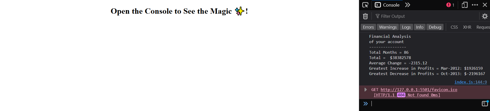

# Console-Finances
This is a real-world application of JavaScript used for analysing the financial records of a company. I made use of  the provided data set to create variables and for loops with if statements to calculate the required balance information.

## Objective
Use provided Finance Dataset - Arrays with two fields, Date and Profit/Losses.
Write JavaScript code that analyses the dataset to calculate the following:
- The total number of months included in the dataset.
- The net total amount of Profit/Losses over the entire period.
- The average of the changes in Profit/Losses over the entire period.
- The greatest increase in Profit/Losses (date and difference in the amounts) over the entire period.
- The greatest decrease in Profit/Losses (date and difference in the amounts) over the entire period.
Display the data logged in console.

## Console screenshot

### Github Repo
https://github.com/DonielM/console-finances
### Deployed Application
https://donielm.github.io/console-finances/

